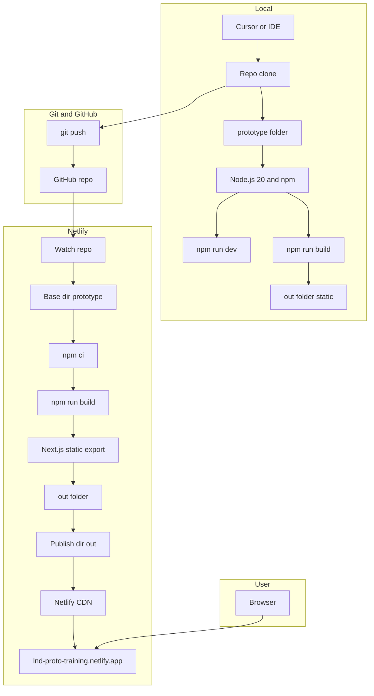
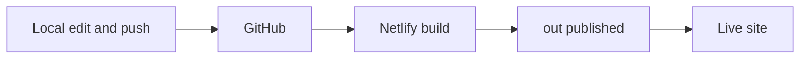
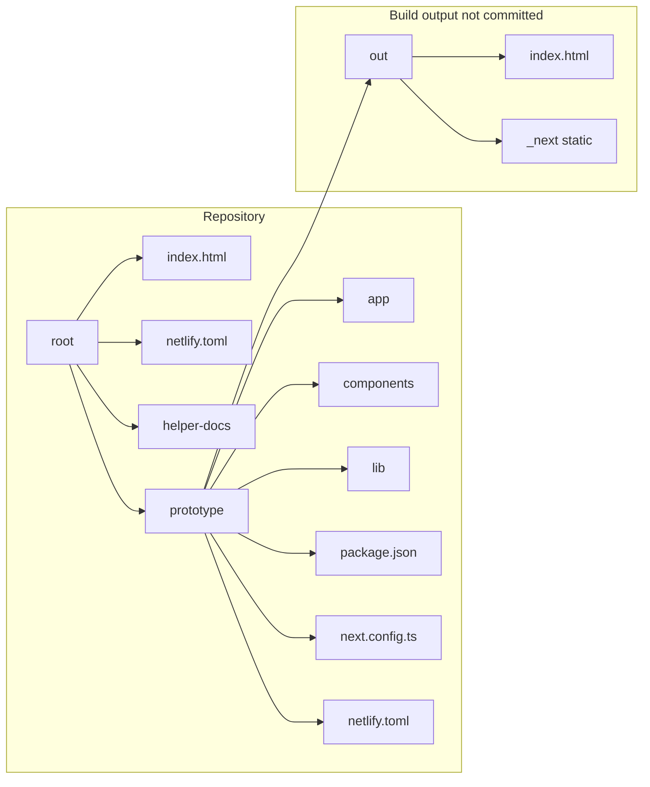
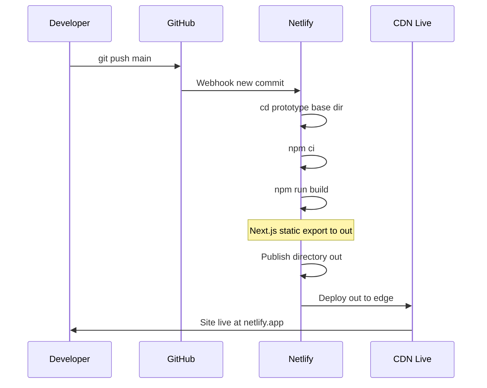

# Stack overview – local → Git → Netlify

Mermaid diagram of how the project flows from your machine to the live site.

## Full stack diagram

## Simplified flow (left to right)

## Repo structure (what lives where)

## Build pipeline (Netlify step by step)

## Key pieces

| Piece | Role |
|-------|------|
| **Local** | Clone repo, `cd prototype`, `npm install` / `npm run dev` or `npm run build`. Edit in Cursor; commit & push. |
| **Git / GitHub** | Source of truth. Netlify is connected to the repo and builds on push (e.g. `main`). |
| **Netlify** | Reads root or base `netlify.toml`; base = `prototype`, command = `npm ci && npm run build`, publish = `out`. Builds in `prototype/`, gets static export in `out/`, deploys that. |
| **Browser** | User opens the Netlify URL; CDN serves static HTML/JS/CSS from `out/`. |

To view the diagrams, open this file in an editor or viewer that supports Mermaid (e.g. GitHub, VS Code with a Mermaid extension, or [mermaid.live](https://mermaid.live)).
